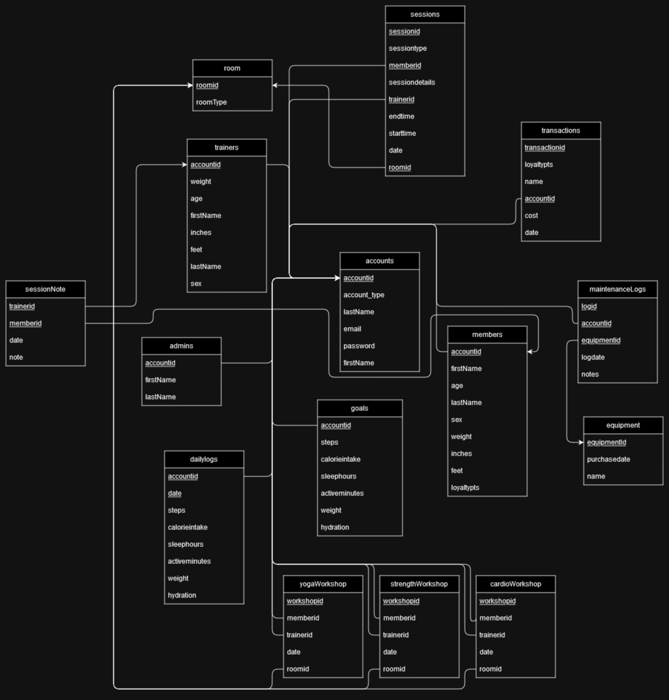
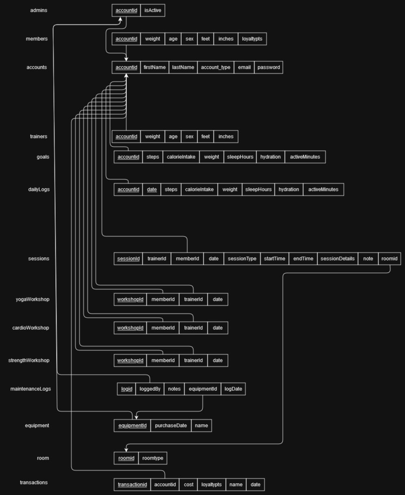

# COMP 3005 Final Project

# Health App 3000

## Table of Contents

- [Introduction](#introduction)
- [Team Members](#team-members)
- [Conceptual Design](#conceptual-design)
- [Reduction to Relation Schemas](#reduction-to-relation-schemas)
- [Normalization of Relation Schemas](#normalization-of-relation-schemas)
- [Database Schema Diagram](#database-schema-diagram)

## Introduction

Welcome to the Health App 3000 Fitness Workout App repository, developed as the final project for the Carleton University COMP 3005 course. This project serves as the culmination of our academic endeavors, where we were tasked with the development of a workout application designed to cater to the diverse needs of fitness enthusiasts. The FitnessPal Workout App offers a user-friendly interface, personalized workout plans, progress tracking, and more.

## Team Members

Connor Gomes
Will Chartrand

# Conceptual Design

Design of the Database:

## Entities

### Accounts:
Stores the basic data that both trainers and members have such as the first name, last name, account type, email, and password.

### Members:
Stores user specific data such as the weight, age, sex, height, and number of loyalty points of the user.

### Trainers:
Similar to Members, trainers have basic information stored in them. Other tables such as the Sessions and the various Workshops (YogaWorkshop, CardioWorkshop, StrengthWorkshop) rely on trainers.

### Admins:
Responsible for adding logs for the equipment’s maintenance, overseeing club activities and payments.

### Goals:
Goals contain a set of various health statistics that are set by the Member. Contains fields such as steps, calorie intake, weight, sleep hours, hydration, minutes of physical activity.

### DailyLogs:
The daily recording of the progress made toward each goal. Contains the same fields as goals, with the addition of a date in order to keep track of when the log was created.

### Sessions:
Stores information about the session events that Members may partake in. Stores fields such as the Trainer’s ID, the ID of the Member, date, type of session, start time, end time, note, and the ID of the room that the event is taking place in.

### YogaWorkshop, StrengthWorkshop, CardioWorkshop:
All workshop tables hold information about the Members attending, the Trainer hosting the Workshop, and the date at which it takes place.

### MaintenanceLogs:
Stores information about when the Administers have performed a maintenance job on a specific piece of equipment, as well as the date, and notes if any.

### Equipment:
Stores the name of a specific piece of equipment as well as the date at which it was purchased.

### Room:
Stores the room ID number and the type of room. Rooms are where the events such as Sessions and Workshops take place.

### Transactions:
The various transactions that the Admins may view from 

### SessionNote:
Stores the notes taken by a Trainer for a specific session with a Member.
Conceptual Design

## Relationships:
- Member-Goal: One-to-One relationship, as a member can have multiple fitness goals.
- Member-DailyLog: One-to-Many relationship, as a member can have multiple daily logs.
- Trainer-Session: One-to-Many relationship, as a trainer can conduct multiple sessions.
- Trainer-Workshop: One-to-Many relationship, as a trainer can host multiple workshops.
- Admin-Equipment: One-to-Many relationship, as an admin manages multiple pieces of equipment.
- Admin-Transaction: One-to-Many relationship, as an admin handles and oversees multiple financial transactions.

Assumptions:
- A member can have multiple daily logs, and attend various sessions/workshops.
- Trainers can conduct multiple sessions and host multiple workshops.
- Admins manage multiple equipment, rooms, and financial transactions.
- There is a Many-to-Many relationship between members and workshops, as a member can register 	for multiple workshops, and a workshop can have multiple members.
- Loyalty points earned by members are tracked in the Transaction entity.

## Features

- **User Registration and Profile Management**
  - Members can easily register and manage their profiles.
  - Set personal fitness goals and input health metrics.

- **Personalized Dashboard**
  - Access a personalized dashboard to track exercise routines, fitness achievements, and health statistics.

- **Appointment Management**
  - Schedule, reschedule, or cancel personal training sessions with certified trainers.

- **Class Registration**
  - Register for group fitness classes, workshops, and events.
  - Stay updated with schedules and receive timely reminders for sessions.

- **Loyalty Program**
  - Every transaction earns members loyalty points.
  - Loyalty points can be redeemed for future services.

## Trainer Features

- **Schedule Management**
  - Efficiently manage schedules for personal training sessions.

- **Member Profiles**
  - View detailed member profiles for personalized training.

- **Progress Notes**
  - Input progress notes after each training session.

## Administrative Staff Features

- **Resource Management**
  - Manage room bookings and monitor fitness equipment maintenance.

- **Class Schedule Updates**
  - Update and manage class schedules.

- **Billing and Payments**
  - Process payments for membership fees, personal training sessions, and other services.

- **Quality Assurance**
  - Monitor club activities for quality assurance.

- **Loyalty Program Oversight**
  - Manage the loyalty program, tracking and redeeming member loyalty points.

## Unique Selling Points

- **Comprehensive Loyalty Program**
  - Every transaction contributes to earning loyalty points.
  - Loyalty points can be redeemed for future services.

---

# Normalization of Relation Schemas

**2NF**

Second normal form is defined as every table has each non-key attribute specifically relating to the entire primary key. That is, every attribute that is not a primary key must specifically utilize the entire primary key in order to be second normal form.

Admins Table 2NF Proof:
Admin table consists of accountid as a primary key and isActive as a non-key attribute. The non-key attribute isActive directly relates to the accountid.

Members Table 2NF Proof:
The primary key of the members table is accountid. The non key attributes are weight, age, sex, feet, inches, and loyalty points. All of these non-key attributes directly relate to the accountid

Accounts Table 2NF Proof:
The Primary key of the accounts table is an accountid. The non key attributes are, firstName, lastName, account_type, email, and password. All of these non key attributes directly relate to  the accountid

Trainer Table 2NF Proof:
The Primary key of the accounts table is an accountid. The non key attributes are, weight, age, sex, feet and inches. All of these attributes directly relate to an accountid

Goals Table 2NF Proof:
The Primary key of the goals table is an accountid. The non key attributes are, steps, calorieIntake, weight, sleepHours, hydration, and activeMinutes.

DailyLogs Table 2NF Proof:
The Primary key of the dailyLogs table is an accountid and date. This is a composite primary key because each user can update their logs every day. The non key attributes are, steps, calorieIntake, weight, sleepHours, hydration, and activeMinutes.

Sessions Table 2NF Proof:
The Primary key of the sessions table is an accountid. The non key attributes are, trainerId, memberId, date, sessionType, startTime, endTime, sessionDetails, note and roomid. All of these non key attributes directly relate to the sessionid.

Workshop Table 2NF Proof:
All the workshops are structured the same. They have a workshopid as the primary key. The non key attributes are memberid, trainerid and date. All of these nonkey attributes directly relate to the primary key.

MaintainceLogs Table 2NF Proof:
The Maintanince logs have a primary key of logid. The non key attributes are loggedby, notes, equipmentid and logdate. All of these nonkey attributes directly relate to the primary key.

Equipment Table 2NF Proof:
The equipment table has an equipmentid as a primary key and a purchasedate and name as non key attributes. These two attributes directly relate to the primary key

RoomTable 2NF Proof:
The room table has an roomid as a primary key and a roomtype as a non key attribute. The room type directly relates to the primary key

Transactions Table 2NF Proof:
The transaction table has a transactionid as the primary key. Each non key attribute, accountid, cost, loyaltypts, name, date all directly relate to the transactionid

**3NF**

Third normal form is defined as every non-key attribute in a table should depend on the key, the whole key and nothing but the key. That is, nonkey-attributes should not depend on each other but instead only depend on the primary key

Admins Table 2NF Proof:
The admin table does not have multiple non-key attributes thus they cannot depend on each other

Members Table 2NF Proof:
None of the non key attributes within the member table depend on each other thus this table passes third normal form.

Accounts Table 2NF Proof:
None of the non key attributes within the accounts table depend on each other thus this table passes third normal form.

Trainer Table 2NF Proof:
None of the non key attributes within the trainer table depend on each other thus this table passes third normal form.

Goals Table 2NF Proof:
None of the non key attributes within the goals table depend on each other thus this table passes third normal form.

DailyLogs Table 2NF Proof:
None of the non key attributes within the dailylogs table depend on each other thus this table passes third normal form.

Sessions Table 2NF Proof:
None of the non key attributes within the sessions table depend on each other thus this table passes third normal form.

Workshop Table 2NF Proof:
None of the non key attributes within the workshops tables depend on each other thus this table passes third normal form.

MaintainceLogs Table 2NF Proof:
None of the non key attributes within the maintaincelogs table depend on each other thus this table passes third normal form.

Equipment Table 2NF Proof:
None of the non key attributes within the equipment table depend on each other thus this table passes third normal form.

RoomTable 2NF Proof:
None of the non key attributes within the room table depend on each other thus this table passes third normal form.

Transactions Table 2NF Proof:
None of the non key attributes within the transactions table depend on each other thus this table passes third normal form.

**Conclusion:**

All the tables within the database follow first and second normal form since 

a) All of the non-key attributes directly relate to the primary key
b) None of the non-key attributes depend on each other, that is, all the non-key attributes only depend on the primary key and nothing else

---

# Database Diagrams

#### Schema Diagram

#### ER Model

#### Relational Schema

