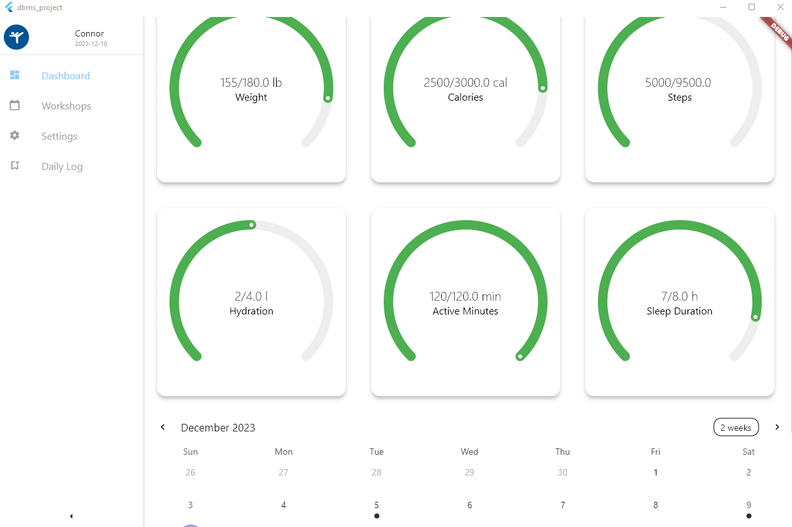

# COMP 3005 Final Project

# Health App 3000

## Table of Contents

- [Introduction](#introduction)
- [Team Members](#team-members)
- [Conceptual Design](#conceptual-design)
- [Reduction to Relation Schemas](#reduction-to-relation-schemas)
- [Normalization of Relation Schemas](#normalization-of-relation-schemas)
- [Database Schema Diagram](#database-schema-diagram)

## Introduction

Welcome to the Health App 3000 Fitness Workout App repository, developed as the final project for the Carleton University COMP 3005 course. This project serves as the culmination of our academic endeavors, where we were tasked with the development of a workout application designed to cater to the diverse needs of fitness enthusiasts. The FitnessPal Workout App offers a user-friendly interface, personalized workout plans, progress tracking, and more.

## Team Members

Connor Gomes
Will Chartrand

# Conceptual Design

Design of the Database:

## Entities

### Accounts:
Stores the basic data that both trainers and members have such as the first name, last name, account type, email, and password.

### Members:
Stores user specific data such as the weight, age, sex, height, and number of loyalty points of the user.

### Trainers:
Similar to Members, trainers have basic information stored in them. Other tables such as the Sessions and the various Workshops (YogaWorkshop, CardioWorkshop, StrengthWorkshop) rely on trainers.

### Admins:
Responsible for adding logs for the equipment’s maintenance, overseeing club activities and payments.

### Goals:
Goals contain a set of various health statistics that are set by the Member. Contains fields such as steps, calorie intake, weight, sleep hours, hydration, minutes of physical activity.

### DailyLogs:
The daily recording of the progress made toward each goal. Contains the same fields as goals, with the addition of a date in order to keep track of when the log was created.

### Sessions:
Stores information about the session events that Members may partake in. Stores fields such as the Trainer’s ID, the ID of the Member, date, type of session, start time, end time, note, and the ID of the room that the event is taking place in.

### YogaWorkshop, StrengthWorkshop, CardioWorkshop:
All workshop tables hold information about the Members attending, the Trainer hosting the Workshop, and the date at which it takes place.

### MaintenanceLogs:
Stores information about when the Administers have performed a maintenance job on a specific piece of equipment, as well as the date, and notes if any.

### Equipment:
Stores the name of a specific piece of equipment as well as the date at which it was purchased.

### Room:
Stores the room ID number and the type of room. Rooms are where the events such as Sessions and Workshops take place.

### Transactions:
The various transactions that the Admins may view from 

### SessionNote:
Stores the notes taken by a Trainer for a specific session with a Member.
Conceptual Design

## Relationships:
- Member-Goal: One-to-One relationship, as a member can have multiple fitness goals.
- Member-DailyLog: One-to-Many relationship, as a member can have multiple daily logs.
- Trainer-Session: One-to-Many relationship, as a trainer can conduct multiple sessions.
- Trainer-Workshop: One-to-Many relationship, as a trainer can host multiple workshops.
- Admin-Equipment: One-to-Many relationship, as an admin manages multiple pieces of equipment.
- Admin-Transaction: One-to-Many relationship, as an admin handles and oversees multiple financial transactions.

Assumptions:
- A member can have multiple daily logs, and attend various sessions/workshops.
- Trainers can conduct multiple sessions and host multiple workshops.
- Admins manage multiple equipment, rooms, and financial transactions.
- There is a Many-to-Many relationship between members and workshops, as a member can register 	for multiple workshops, and a workshop can have multiple members.
- Loyalty points earned by members are tracked in the Transaction entity.

## Features

- **User Registration and Profile Management**
  - Members can easily register and manage their profiles.
  - Set personal fitness goals and input health metrics.

- **Personalized Dashboard**
  - Access a personalized dashboard to track exercise routines, fitness achievements, and health statistics.

- **Appointment Management**
  - Schedule, reschedule, or cancel personal training sessions with certified trainers.

- **Class Registration**
  - Register for group fitness classes, workshops, and events.
  - Stay updated with schedules and receive timely reminders for sessions.

- **Loyalty Program**
  - Every transaction earns members loyalty points.
  - Loyalty points can be redeemed for future services.

## Trainer Features

- **Schedule Management**
  - Efficiently manage schedules for personal training sessions.

- **Member Profiles**
  - View detailed member profiles for personalized training.

- **Progress Notes**
  - Input progress notes after each training session.

## Administrative Staff Features

- **Resource Management**
  - Manage room bookings and monitor fitness equipment maintenance.

- **Class Schedule Updates**
  - Update and manage class schedules.

- **Billing and Payments**
  - Process payments for membership fees, personal training sessions, and other services.

- **Quality Assurance**
  - Monitor club activities for quality assurance.

- **Loyalty Program Oversight**
  - Manage the loyalty program, tracking and redeeming member loyalty points.

## Unique Selling Points

- **Comprehensive Loyalty Program**
  - Every transaction contributes to earning loyalty points.
  - Loyalty points can be redeemed for future services.

---

# Reduction to Relation Schemas

---

# Normalization of Relation Schemas

---

# Database Schema Diagram
